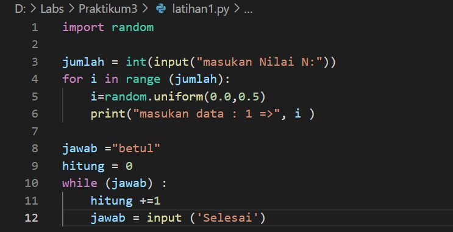

# Praktikum3

## latihan1.py
Soal latihan1.py   
1.Tampilkan n bilangan acak yang lebih kecil dari 0.5   
2.Nilai n di isi paada saat RUN tiime   
3.anda bisa gunakan kombinasi whiledan for untuk menyelesaikan nya  
4.Gunakan fungsi random () yang dapat diimport terlebih dahulu   
*Algoritma latihan1   
Menampilkan n bilangan acak yang lebih kecil dari 0.5 nilai n di isi saat RUN time    
1.Masukan/import fungsi RANDOM terlebih dahulu   
2.Deklarasi integer masukan jumlah   
  masukan deskripsi kombinasi for untuk menyelesaikan    
3.Masukan nilai jumlah (n) : 5   
4.Masukan data ke 1 sampai 5 dengan hasil nilai kurang dari 0.5   
5.Selesi   

## Contoh output nya

## Tampilan sudah di RUN dan memasukan jumlah n

