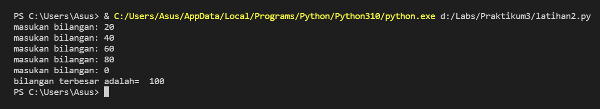

# Praktikum3

## latihan1.py
Soal latihan1.py   
1.Tampilkan n bilangan acak yang lebih kecil dari 0.5   
2.Nilai n di isi paada saat RUN tiime   
3.anda bisa gunakan kombinasi whiledan for untuk menyelesaikan nya  
4.Gunakan fungsi random () yang dapat diimport terlebih dahulu   

*Algoritma latihan1   
Menampilkan n bilangan acak yang lebih kecil dari 0.5 nilai n di isi saat RUN time    
1.Masukan/import fungsi RANDOM terlebih dahulu   
2.Deklarasi integer masukan jumlah   
  masukan deskripsi kombinasi for untuk menyelesaikan    
3.Masukan nilai jumlah (n) : 5   
4.Masukan data ke 1 sampai 5 dengan hasil nilai kurang dari 0.5   
5.Selesi   

## Contoh output latihan1

## Tampilan sudah di RUN dan memasukan jumlah n

## latihan2.py
Soal latihan2.py  
Buat program untuk menampilkan bilangan terbesar dari n buah data yang diinputkan  
Masukan angka 0 untuk berhenti  

*Algoritma latihan2  
1.Integer max=100  
2.Menggunakan fungsi perulangan while true, hingga menampilkan perulangan sampai batas tertentu  
3.Masukan bilangan integer pada a  
4.Menggunakan if jika max kurang dari nilai a, maka max sama dengan a  
5.Menggunakan fungsi if jika nilai a adalah 0, maka fungsi break artinya perulangan berhenti jika menulis nilai 0  
6.Mencetak nilai paling terbesar setelah break, sehingga menampilkan nilai terbesar diantara bilangan tersebut dalam perulangan  
7.Selesai  

## Contoh output latihan2

## Tampilan setelah di RUN 

